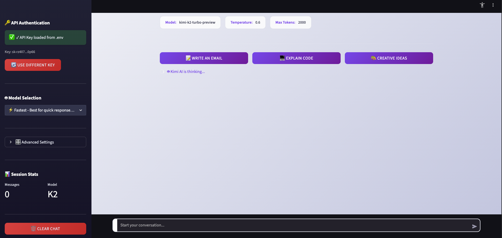

# Kimi AI Chat App

A simple and user-friendly Streamlit application for chatting with Kimi AI, powered by Moonshot AI's advanced language models.

## 📸 Screenshot



*Modern, professional interface with dark sidebar and clean gradient background*

## Features

- 💬 **Real-time Chat**: Interactive conversation with Kimi AI
- 🤖 **Multiple Models**: Choose from various Kimi AI models (kimi-k2-turbo-preview, moonshot-v1 series, etc.)
- ⚡ **Fast Response**: Optimized for quick and efficient responses
- 💾 **Conversation Memory**: Maintains chat history throughout the session
- 🎨 **Modern UI**: Beautiful gradient design with smooth animations
- ⚙️ **Customizable Settings**: Adjust temperature, max tokens, and model selection
- 🔒 **Secure**: API key stored securely in session state

## Installation

1. **Clone or download the project files**

2. **Install Poetry** (if not already installed):
   ```bash
   curl -sSL https://install.python-poetry.org | python3 -
   ```

3. **Install dependencies**:
   ```bash
   poetry install
   ```

4. **Activate the virtual environment**:
   ```bash
   poetry shell
   ```

5. **Get your Kimi AI API key**:
   - Visit [platform.moonshot.ai](https://platform.moonshot.ai)
   - Create an account and generate an API key
   - Add credits to your account (minimum $1 to start)

6. **Run the application**:
   ```bash
   poetry run streamlit run kimi_chat_app.py
   ```
   
   Or if you've activated the virtual environment with `poetry shell`:
   ```bash
   streamlit run kimi_chat_app.py
   ```

## Usage

1. **Launch the app**: The app will open in your default browser
2. **Enter API Key**: Paste your Kimi AI API key in the sidebar configuration panel
3. **Configure Settings**: 
   - Choose your preferred model
   - Adjust temperature (0.0 = deterministic, 1.0 = creative)
   - Set maximum response tokens
4. **Start Chatting**: Type your messages in the chat input at the bottom

## Configuration Options

### Models Available
- **kimi-k2-turbo-preview**: Fast and efficient (recommended)
- **kimi-k2-0711-preview**: Latest Kimi K2 model
- **kimi-k2-0905-preview**: Enhanced version with improved reasoning
- **moonshot-v1-8k**: Standard model with 8k context
- **moonshot-v1-32k**: Extended context model
- **moonshot-v1-128k**: Maximum context model

### Temperature Settings
- **0.0-0.3**: Factual, deterministic responses
- **0.4-0.6**: Balanced responses (default: 0.6)
- **0.7-1.0**: Creative and varied responses

### Max Tokens
- Range: 100-4000 tokens
- Default: 2000 tokens
- Adjust based on expected response length

## API Integration

The app uses Moonshot AI's OpenAI-compatible API endpoint:
- **Base URL**: `https://api.moonshot.cn/v1`
- **Authentication**: Bearer token with your API key
- **Compatibility**: Works with standard OpenAI SDK

## Error Handling

The app includes comprehensive error handling for:
- Invalid API keys
- Network connectivity issues
- Rate limiting
- API errors
- Timeout issues

## Security Notes

- API keys are stored in Streamlit session state (memory-only)
- Keys are never saved to disk or logs
- Use environment variables for production deployment
- Never share your API key publicly

## Troubleshooting

### Common Issues

1. **"Invalid API Key" error**:
   - Verify your API key is correct
   - Check that you have sufficient credits
   - Ensure the key is active in your Moonshot AI dashboard

2. **"Connection Error"**:
   - Check your internet connection
   - Verify firewall settings
   - Try refreshing the page

3. **"Rate Limit Error"**:
   - Reduce request frequency
   - Check your usage limits in the Moonshot AI dashboard
   - Consider upgrading your plan

4. **App won't start**:
   - Ensure all dependencies are installed: `poetry install`
   - Check Python version (3.8+ recommended)
   - Verify Streamlit installation: `poetry run streamlit --version`

### Getting Help

- Check the [Moonshot AI Documentation](https://platform.moonshot.cn/docs)
- Visit the [Kimi AI Community](https://platform.moonshot.ai)
- Review Streamlit documentation for deployment issues

## Deployment

### Local Development
```bash
poetry run streamlit run kimi_chat_app.py
```

Or with activated environment:
```bash
poetry shell
streamlit run kimi_chat_app.py
```

### Production Deployment
For production deployment, consider:
- Using environment variables for API keys
- Implementing user authentication
- Adding usage monitoring
- Deploying to Streamlit Cloud, AWS, or other platforms

## Development

### Project Structure
```
kimi-chat-app/
├── kimi_chat_app.py    # Main application
├── pyproject.toml      # Poetry configuration & dependencies
├── poetry.lock         # Locked dependency versions
└── README.md          # Documentation
```

### Contributing
Feel free to fork and improve this application. Suggestions welcome!

## License

This project is open source. Feel free to use and modify as needed.

## Acknowledgments

- **Moonshot AI** for providing the Kimi AI API
- **Streamlit** for the amazing framework
- **OpenAI** for the compatible API standard
